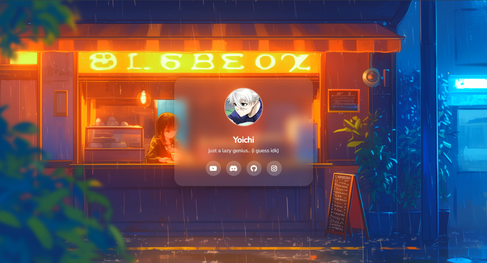

A clean, calm, and minimal profile page template with blur card, avatar, bio, and icon links.


## 📘 Features
- Clean and minimal design
- Clean blur effect card
- Avatar / Profile picture
- Bio section
- Icon-based social links
- Fully responsive on desktop and mobile
- Customizable fonts and background


## 📘 Installing Steps:
1. Go to `Releases` section and download lastest release of the page.
2. Or clone it using:
   ```bash
   git clone https://github.com/YoichiMt/clean-profile-page

## 📘 How to use:
• Edit `index.json` and `styles.css` to customize your page.<br/>
• Replace `avatar.jpg` with your own avatar.<br/>
• Replace `background.jpg` with your preferred image.<br/>

## 📘 How to add links:
Use `<a href="your_link_here"><i class="fab fa-social_name_here"></i></a>` in `index.html` to add link.<br/>
Example:
```css
<a href="https://github.com/YoichiMt"><i class="fab fa-github"></i></a>
```

## 📘 How to change font:
Goto `font-family: 'FONT_NAME_HERE', sans-serif;` line in `styles.css` and edit it with your prefered one.<br/>
Example:
```css
font-family: 'Nunito', sans-serif;
```
Don't forget to change `@import url('https://fonts.googleapis.com/css2?family=FONT_NAME_HERE&display=swap');` too (if you're using google fonts).<br/>
And change `FONT_NAME_HERE` to the same font that used in `font-family`.

## 🛑 Disclaimer:
This code/page made by **YoichiMt** and is licensed under the GNU General Public License v3.0 (GPL-3.0).<br/>
You are free to use, modify, and distribute this code, provided that all copies and derivative works are also licensed under GPL-3.0.<br/>
Any use must include proper attribution to the original author.<br/>
The author cannot be held responsible for any damages or issues resulting from the use of this code by users.

## 📌 Screenshots:
<br/>
---

